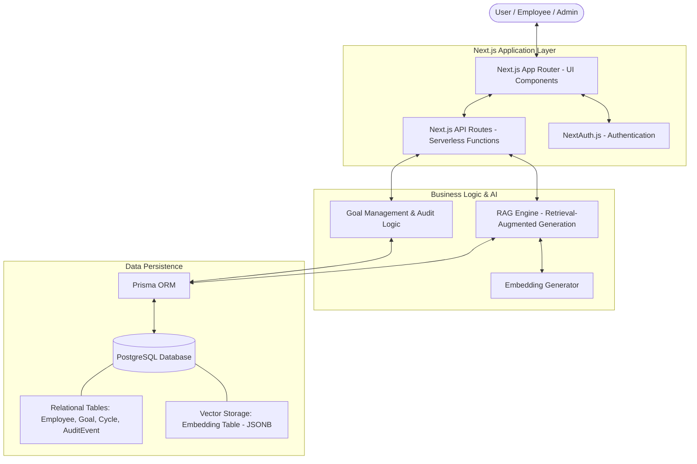

# Project Submission: GoalPulse (Cadence)

## 1. Working Link
- **Deployment URL:** [https://cadence-atomberg.vercel.app/](https://cadence-atomberg.vercel.app/) (Placeholder - Replace with actual deployment URL if different)
- **Local Development:** `http://localhost:3000`

## 2. Source Code Repository
- **GitHub Repository:** [https://github.com/sai-chakrith/cadence.git](https://github.com/sai-chakrith/cadence.git)

## 3. Architecture Diagram

### Architectural Overview
- **Framework:** Next.js 16 (App Router) for a unified full-stack experience with React 19.
- **Authentication:** NextAuth.js for secure session management and role-based access control (Admin, Manager, Employee).
- **Database & ORM:** PostgreSQL hosted on Docker/Cloud, managed via Prisma ORM for type-safe database interactions.
- **AI/RAG System:** 
    - **Embeddings:** Business data (goals, audits) are converted into vector embeddings and stored directly in PostgreSQL.
    - **Retrieval:** The RAG Command Center uses natural language queries to retrieve relevant context from the database.
    - **Synthesis:** Insights are generated based on real-time goal progress and audit history.
- **Styling:** Tailwind CSS for a modern, responsive "Aurora" aesthetic.
